# Exercise 2: Building an eForm with Record Producer
{: .fs-9 .text-blue-100}

**Duration: 20 minutes**

## Introduction
{: .text-blue-100}

From last exercise, we have configured the form for back office use. In this section, using the Record Producer, we will create a more user friendly and graphical eForm for users to make WFA requests.  As you will experience, we will encorporate the eFrom into Service Portal and/or Employee Center easily via wizard guided configurations.  

## Create the Record Producer
{: .text-blue-100}
1.  Return to the AES **App Home** tab.  Click **+Add** next to the section Experience.

    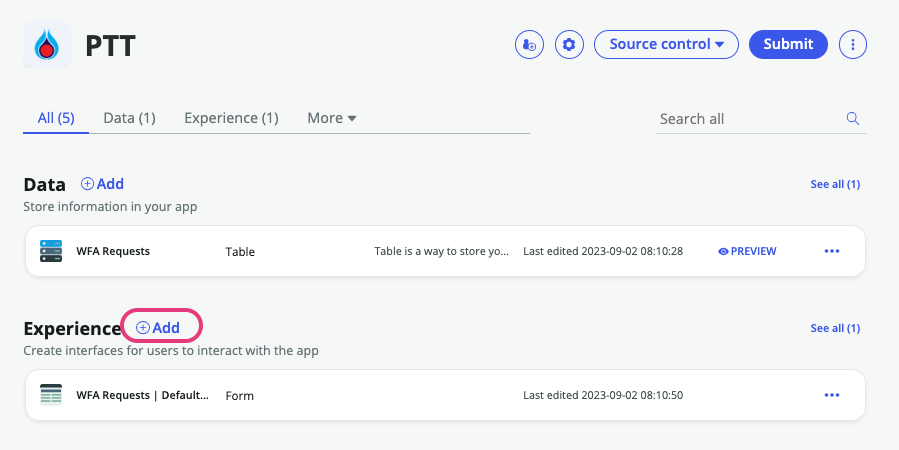

{:style="counter-reset:none"}
1.  On the **_What type of experience do you want to add to your app?_** page, select **Record producer**. Click **Begin**.

    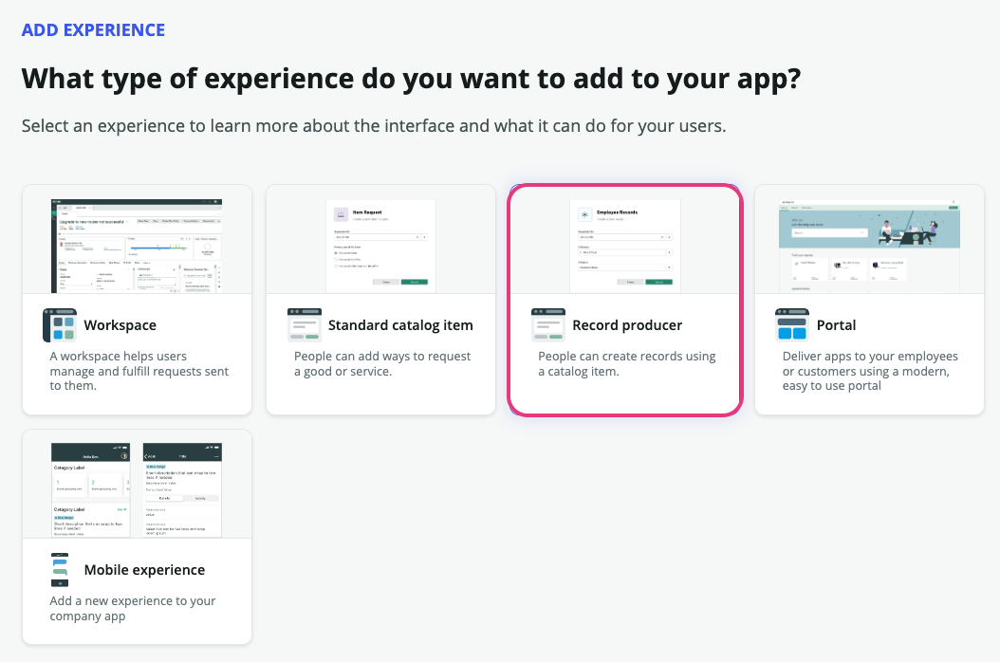

{:style="counter-reset:none"}
1.  On the **_Let's set up your record producter._** page, name the record producer  **PTT WFA Requests** , and for description, enter  **Fill in this form to submit a Work From Anywhere (WFA) request.** .  Click **Continue**.

    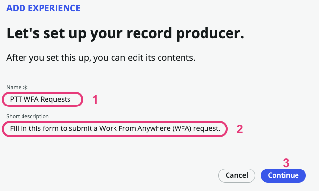

{:style="counter-reset:none"}
1. On the **_Success! You added a record producer_** page, click **Edit record producer** button. 

    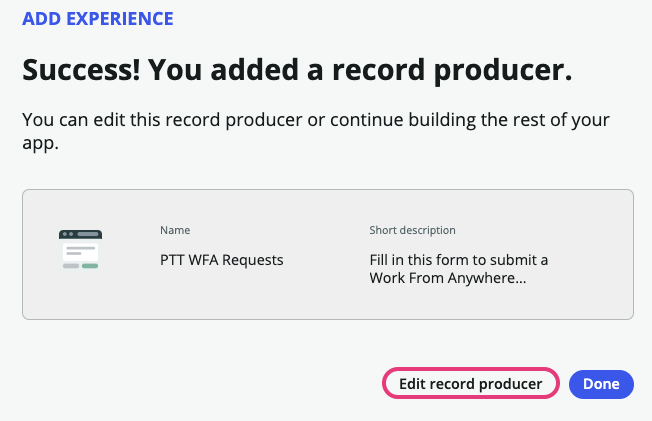

{:style="counter-reset:none"}
1. Navigate the steps of the record producers in the order as shown on the left side bar menu.  The right sidebar provides information of each step.  __Optionally__, enter item details as **Your request for WFH will be routed to the approver.  Once approved, a PDF attachment will be generated for download.**  and/or attach an icon. 

    

{:style="counter-reset:none"}
1. From top right, cilck the **Save** button, then click the **Preview** button. Review the header of your eForm.  Close the Preview but clicking the **X** on the top right. 

    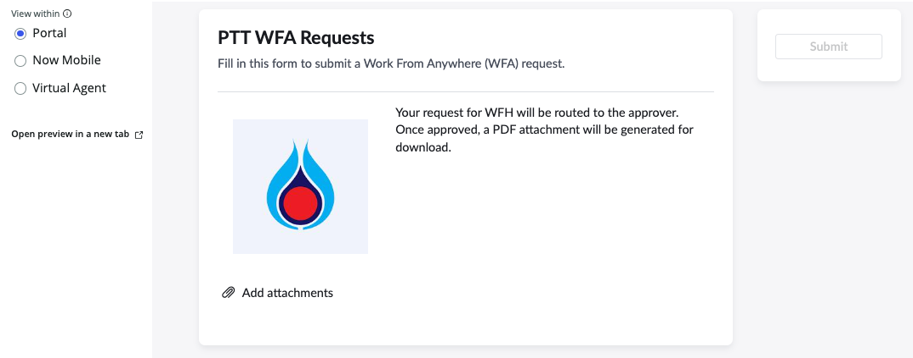

{:style="counter-reset:none"}
1. Click the **Continue to Destination** button on the bottom right of the Details page. 

{:style="counter-reset:none"}
1. On the **_Destination_** page, search and select **WFA Requests** as the Table for record submission. 

    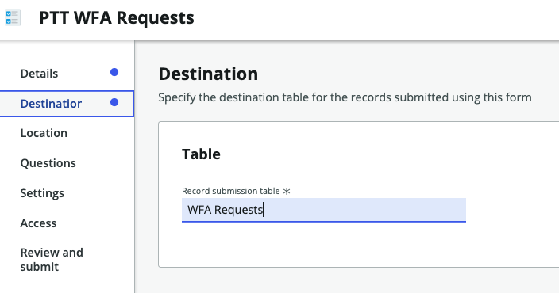

{:style="counter-reset:none"}
1. Click the **Continue to Location** button on the bottom right of the Destination page. 

{:style="counter-reset:none"}
1. On the **_Location_** page, click **Browse Catalogs**, select **Service Catalog**, click the **>** arrow.  Click **Save selections** button. 

    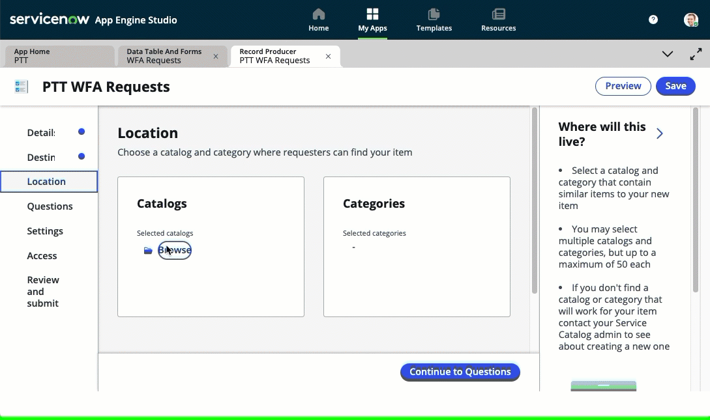

{:style="counter-reset:none"}
1.  On the **_Location_** page, click **Browse Categories**, select  **Can We Help You?**, click the **>** arrow.  Click **Save selections** button. 

    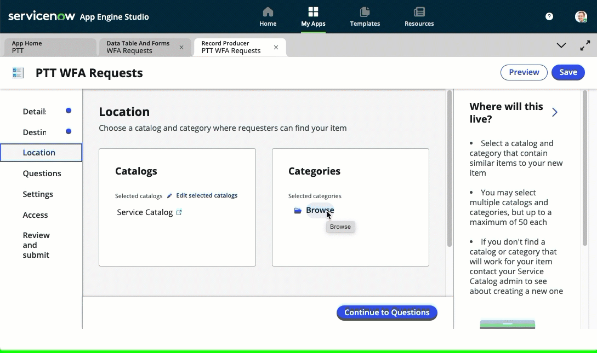

    This is what location should look like:

    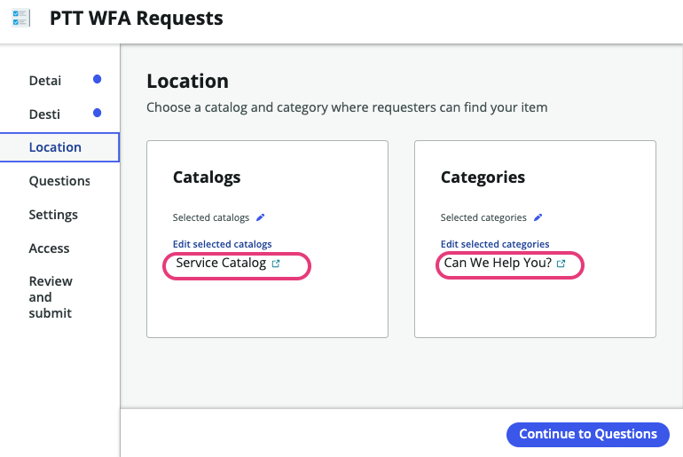

{:style="counter-reset:none"}
1.  Click **Continue to Questions** button.

{:style="counter-reset:none"}
1.  Click the **down arrow** on the **Insert new question** button, select **Two column container**.

    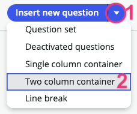

    Insert **WFA Request** as the Title, click **Submit**. 

    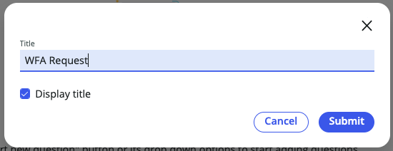

{:style="counter-reset:none"}
1.  Click the **+ Insert** button beneath WFA Request container. Select **Single column container**.

    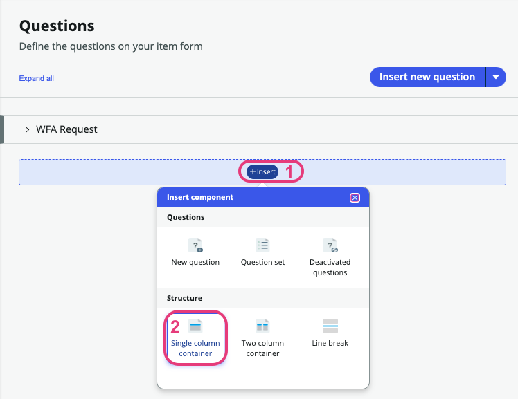

    Insert **Details** as the Title, click **Submit**. 

    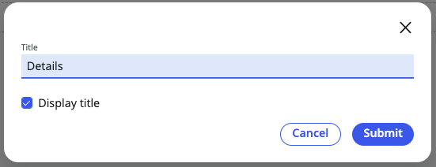
    
{:style="counter-reset:none"}
1.  This is what your questions layout should look like after you click on the **arrow** to expand the containers.

    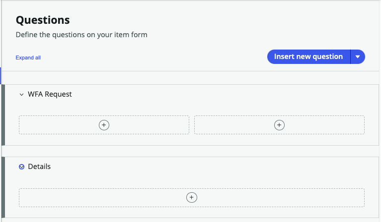
    
{:style="counter-reset:none"}
1.  Within the WFA Request container, click **+ Insert** button, select **New question**. 

    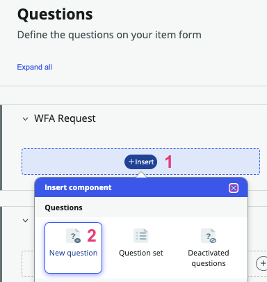
    
{:style="counter-reset:none"}
1.  Fill out the question details as below:

    Name | Selection / Values
    -------------- | --------------
    Question type | **Choice**
    Question subtype | **Dropdown (fixed values)**
    Map to a specific field on the table | **Checked** 
    Table field | **Request type** 
    Question label |**What party would you like to request Work from Anywhere (WFA) for?**
    Mandatory | **Checked**

    Click **Continue to Choices** button.

    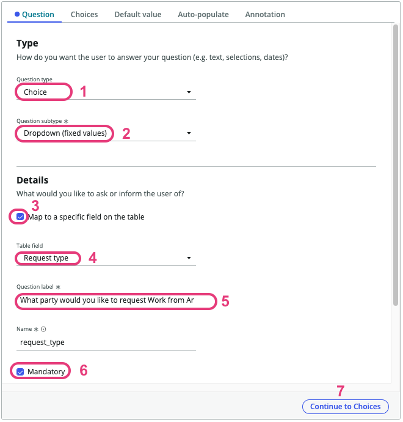
    
    From the Choices tab, in Settings, **Check** the **Include non choice**. In the Available Choices section, enter:

    Display name | Value
    -------------- | --------------
    **WFA for self** |  wfa_for_self
    **WFA for Region** | wfa_for_region

    Click **Continue to Default value button**. 

    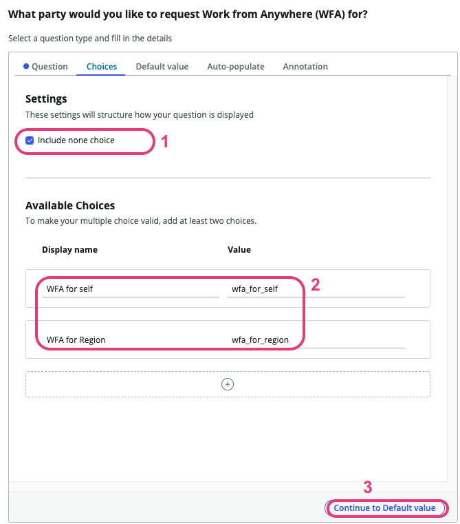
    
    From the Default value tab, select **WFA for self** as the Default value.  Note the option to preview the question on the right sidebar, try out the preview.  Click **Insert question** button. 

    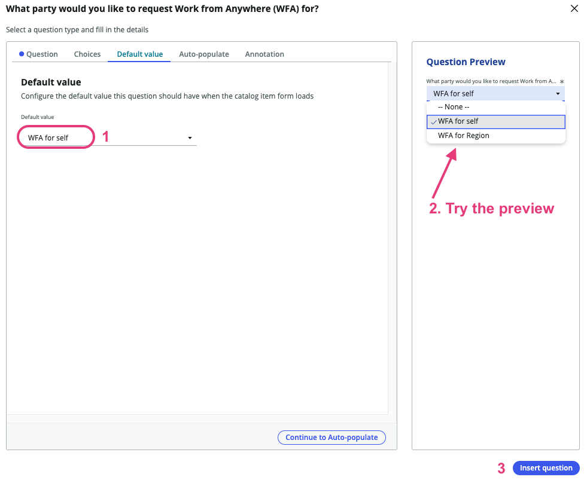

{:style="counter-reset:none"}
1.  Repeat inserting questions in the WFA Request container:

    Name | Selection / Values
    -------------- | --------------
    Question type | **Choice**
    Question subtype | **Record reference**
    Map to a specific field on the table | **Checked** 
    Table field | **Requestor** 
    Question label |**Requestor**
    Mandatory | **Read-only**
    Additional Details >> Source Table | **User \[sys_user]**

    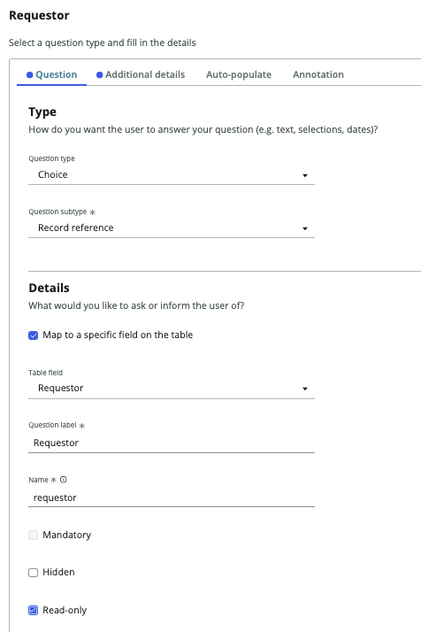

    Click **Continue to Additional details** button. Select **User \[sys_user]** as the **Source table**.  Click the **Insert question** button.
    
    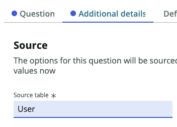

1. Repeat inserting questions in the WFA Request container, this time we are going to insert read-only information about the requestor.

    Name | Selection / Values
    -------------- | --------------
    Question type | **Choice**
    Question subtype | **Record reference**
    Question label |**Requestor Department**
    Mandatory | **Read-only**
    Additional Details >> Source Table | **User \[sys_user]**
    Auto-populate >> depends on | **Requestor** 
    Auto-populate >> field that contains the value | **Department**

    The steps looks like the follows:

    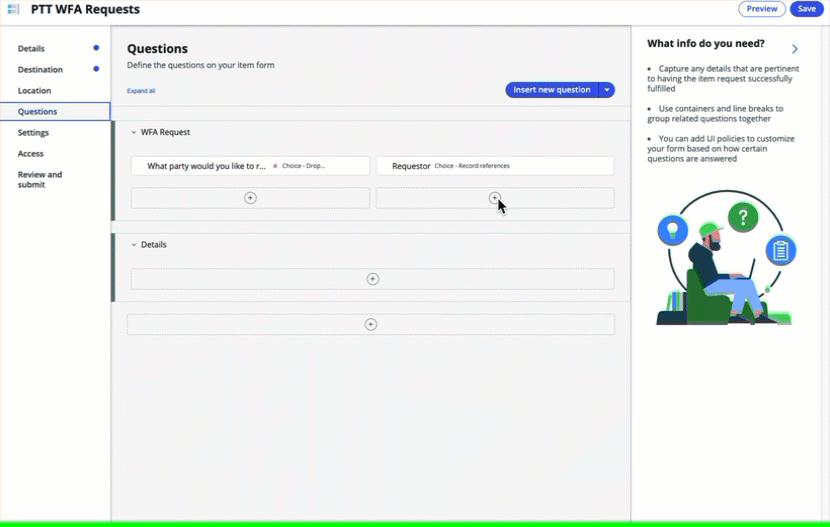

1. Repeat inserting read-only information about the requestor on the form

    Name | Selection / Values
    -------------- | --------------
    Question type | **Choice**
    Question subtype | **Record reference**
    Map to a specific field on the table | **Checked** 
    Table field | **Approver** 
    Question label |**Approver**
    Mandatory | **Read-only**
    Additional Details >> Source Table | **User \[sys_user]**
    Auto-populate >> depends on | **Requestor** 
    Auto-populate >> field that contains the value | **Manager**

    The steps looks like the follows:

    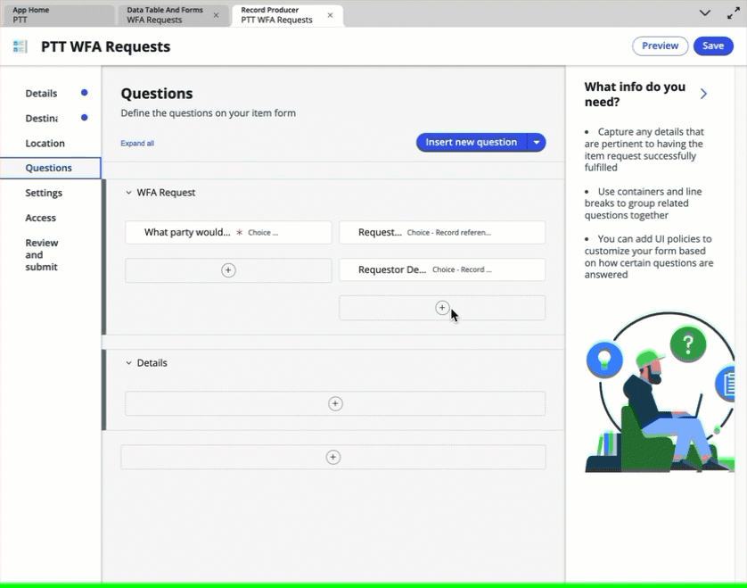

    Click **Insert Question** button. 

{:style="counter-reset:none"}
1.  Repeat inserting questions in the WFA Request container:

    Name | Selection / Values
    -------------- | --------------
    Question type | **Date / Time**
    Question subtype | **Date**
    Map to a specific field on the table | **Checked** 
    Table field | **Start date** 
    Question label |**Please specify the start date of WFA**
    Mandatory | **Checked**

    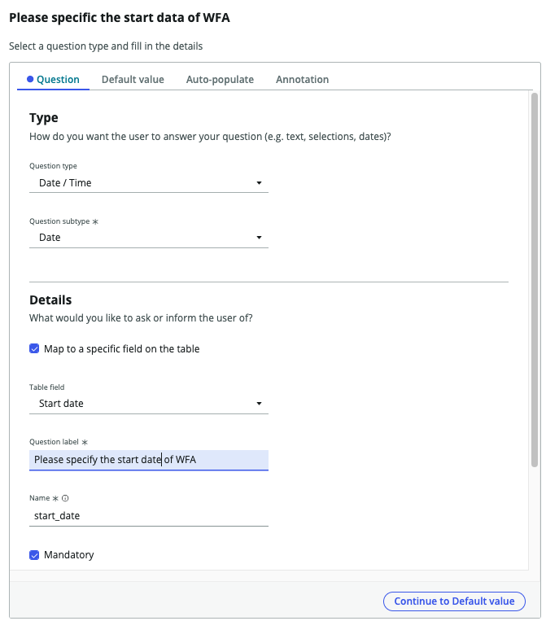

    The steps looks like the follows:

    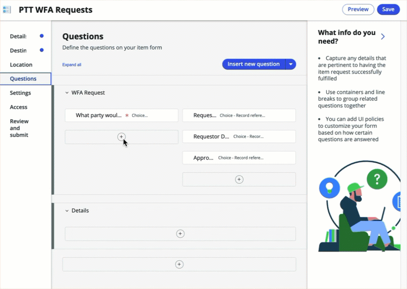
    
{:style="counter-reset:none"}
1.  Repeat inserting questions in the WFA Request container:

    Name | Selection / Values
    -------------- | --------------
    Question type | **Date / Time**
    Question subtype | **Date**
    Map to a specific field on the table | **Checked** 
    Table field | **End date** 
    Question label |**Please specify the end date of WFA**
    Mandatory | **Checked**

    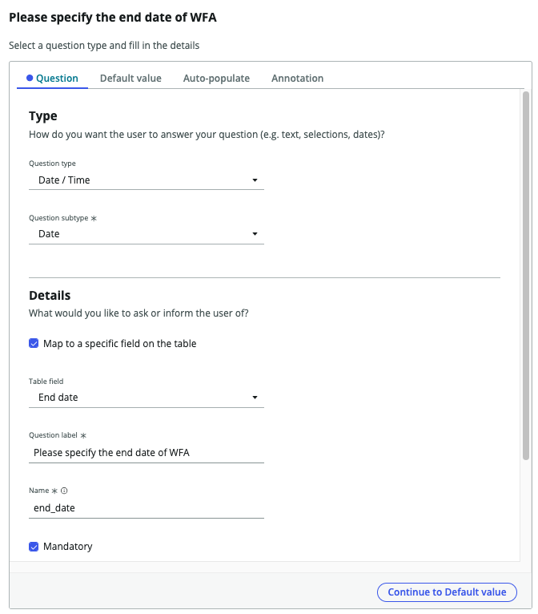
    
{:style="counter-reset:none"}
1.  Up to this point, this is what your Quetions look like:

    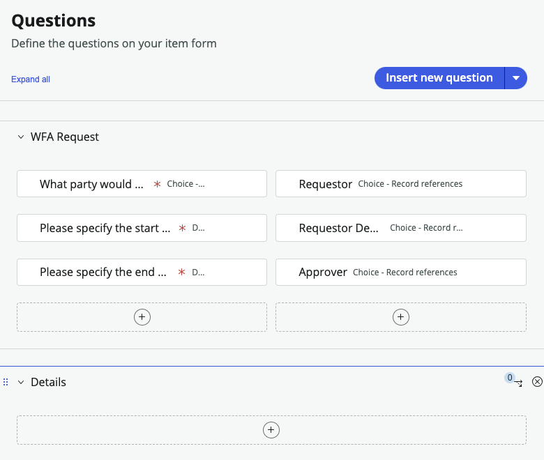
    
{:style="counter-reset:none"}
1.  Let's add questions in the **Details** container.  The details of the new question:

    Name | Selection / Values
    -------------- | --------------
    Question type | **Text**
    Question subtype | **Multi-line**
    Map to a specific field on the table | **Checked** 
    Table field | **Description** 
    Question label |**Please provide a justification for your WFA request**

    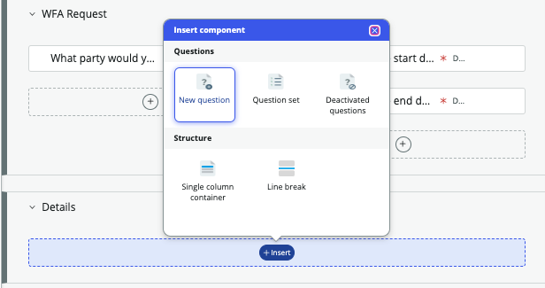

{:style="counter-reset:none"}
1.  Up to this point, this is what your Quetions look like:

    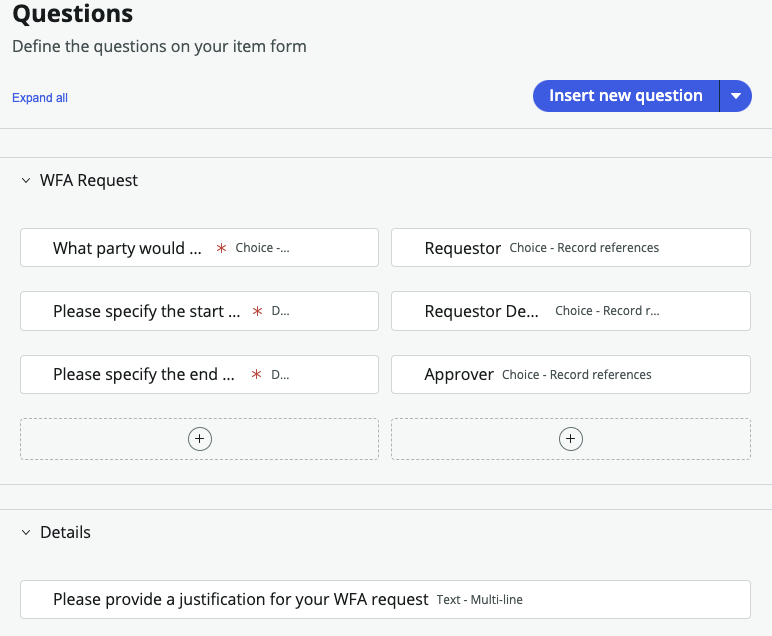   

{:style="counter-reset:none"}
1.  Click the **Preivew** button to preview the record producer, it should look like this"

    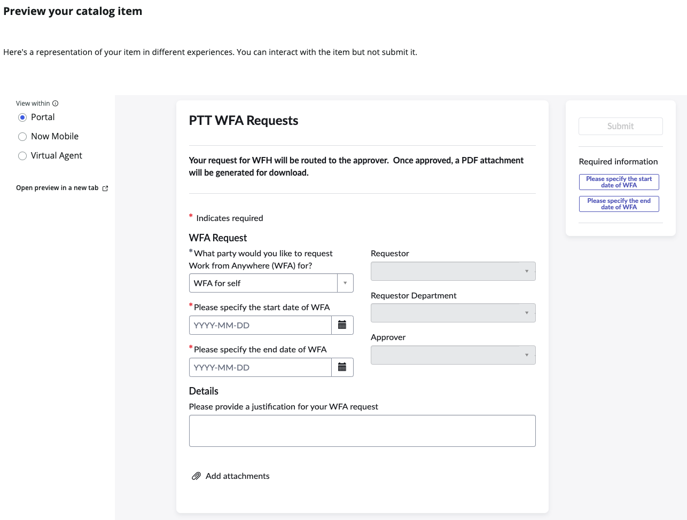

{:style="counter-reset:none"}
1.  Close the **Preview**, and click **Continue to Settings** button

{:style="counter-reset:none"}
1.  From Settings, Check **Hide 'Add to wishlist' button** and Check **Hide attachment button**.  Click **Continue to Access** button. 

    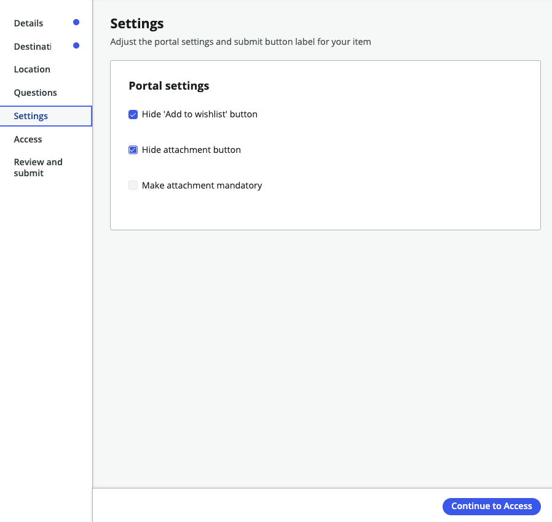
    
{:style="counter-reset:none"}
1.  From Access, select **Available for** as **Any User**.  Click **Continue to Review and Submit**. 

    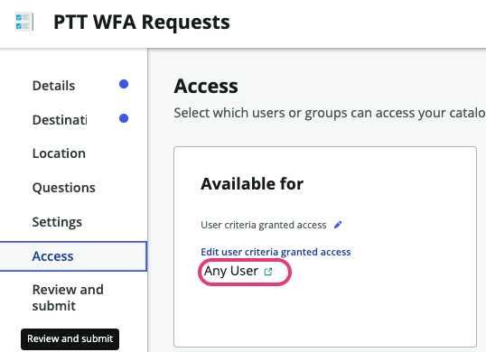
    
{:style="counter-reset:none"}
1.  Click **Submit**

    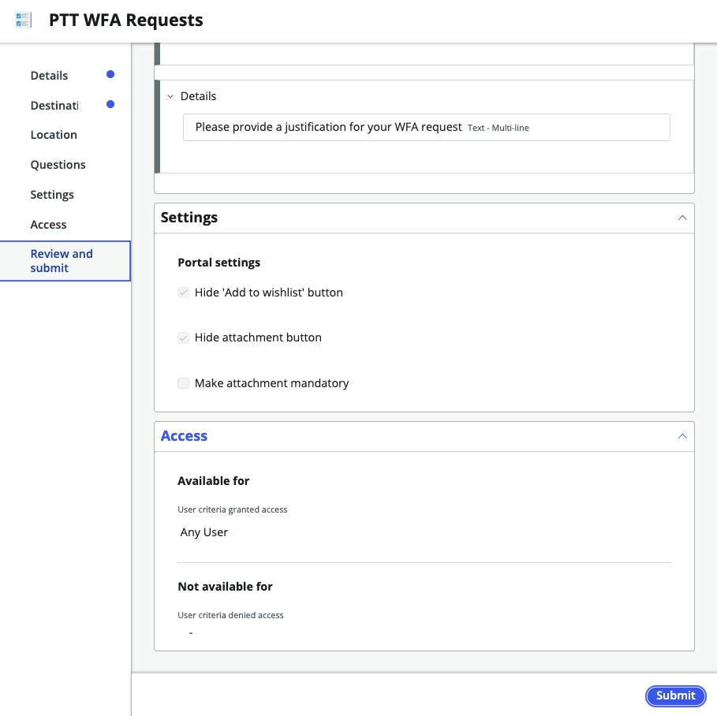
    
    
## Optional: Display requestor info in the form
{: .text-blue-100}

{:style="counter-reset:1"}
1.  In AES, return to **App Home** tab, click open the **PTT WFA Requests** record producer.

    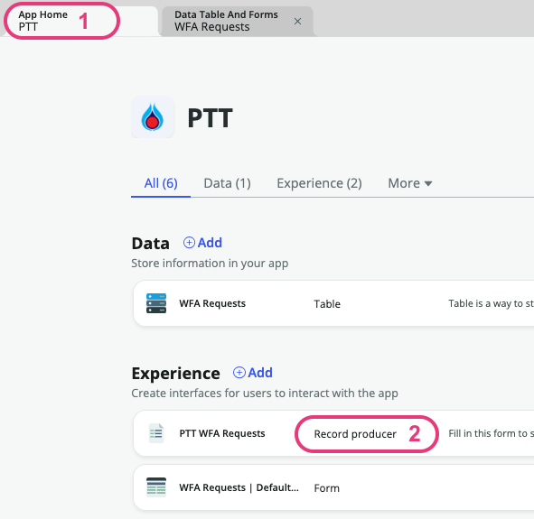
    
{:style="counter-reset:1"}
1.  From the menu, click **Questions**, then add a new question in the **WFA Request** container:

    Name | Selection / Values
    -------------- | --------------
    Question type | **Choice**
    Question subtype | **Record reference**
    Map to a specific field on the table | **Checked** 
    Table field | **Requestor** 
    Question label |**Requestor**
    Read-only | **Checked**

    This is what the question look like:

    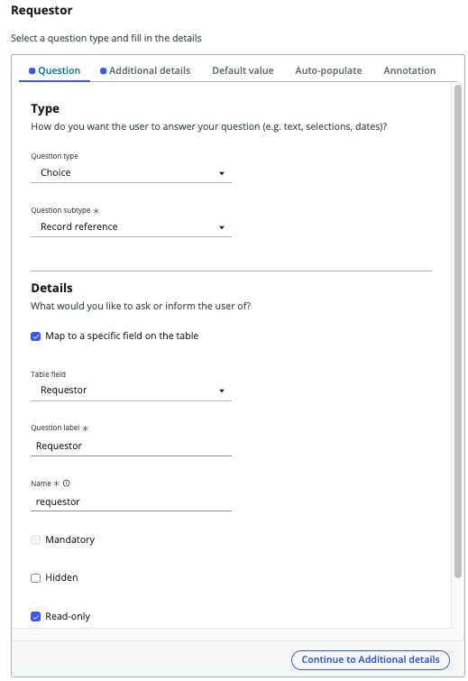
    
{:style="counter-reset:1"}
1.  Click **Additional details** tab, select **User \[sys_user\]** as the Source table.  Click **Insert Question**.

    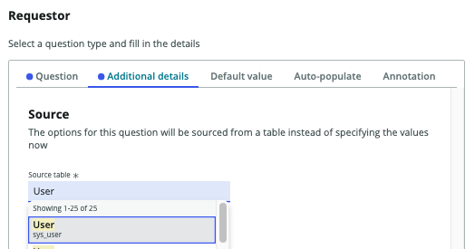
    
    Name | Selection / Values
    -------------- | --------------
    Question type | **Choice**
    Question subtype | **Record reference**
    Question label |**Requestor Department**
    Read-only | **Checked**

    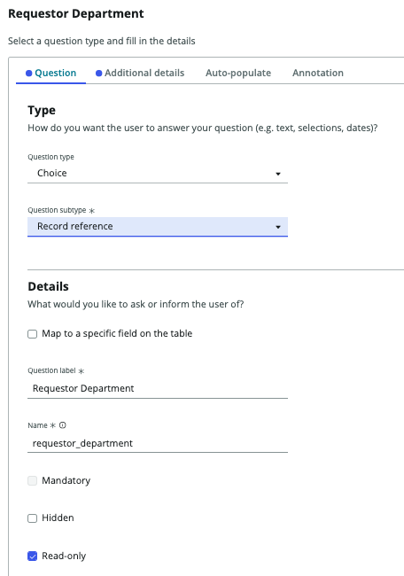
    
    Click **Additional details** tab, select **User \[sys_user\]** as the Source table.  Click **Insert Question**.

    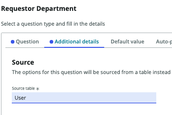
    
    Click **Auto-populate** tab, **select the question this depends on** as **Requestor \| sys_user]**, and **Select the filed that contains the value you want to set** as **Department**

    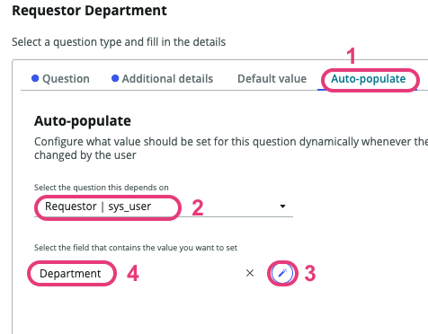

    Click **Insert Question**.
    
{:style="counter-reset:none"}
1.  The Questions should look similar to the below. Click **Save**.

    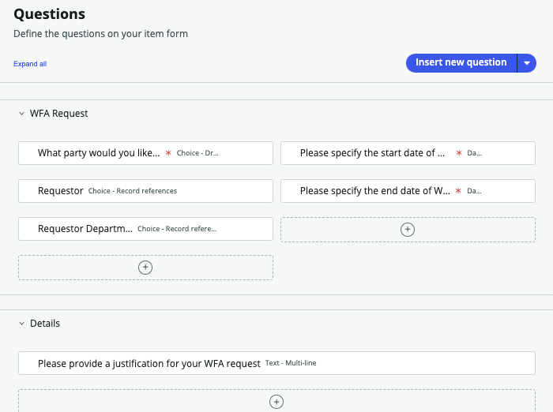

## Configure Requestor as Logged in User
{: .text-blue-100}

{:style="counter-reset:1"}
1.  Return to ServiceNow Platform home page, you can do so by visiting the base URL  in a new browser tab.  For example, **http://\[replace_with_your_instance_ID\].service-now.com**

    From the **All** navigator, search for **Studio**, and select **Studio**.  This will launch the pro-coder Studio tool.  

    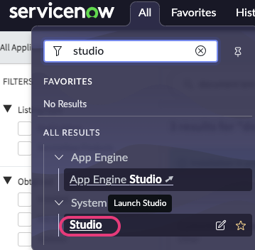
    
{:style="counter-reset:none"}
1.  From Select Application window, search for **PTT** and click on the Application **PTT**.

    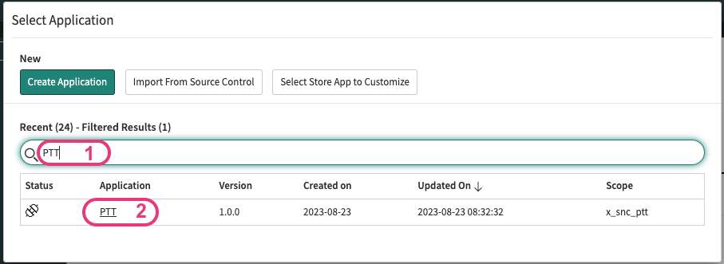
    
{:style="counter-reset:none"}
1.  Note that the **Application Explore** on the left sidebar shows the entire structure of the PTT application you have created using **AES** low code tool.  In the **Service Catalog > Record Producers** section, click **PTT WFA Requests** to open the record producer we previosly created using AES. 

    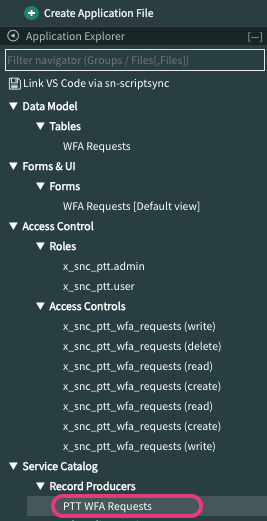

{:style="counter-reset:none"}
1.  From the related list, select the C**atalog Client Scripts** tab. Click **New** to create a new client script.

    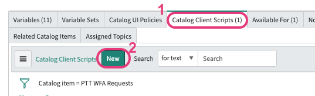

{:style="counter-reset:none"}
1.  From the Catalog Client Script form, enter the following info:

    Name | Selection / Values
    -------------- | --------------
    Name | **Requestor is Me**
    UI type | **All**
    Type | **onLoad** 
    Applies on a Catalog Item view | **Checked** 
    Applies on Target Record| **Checked**
    Script |**g_form.setValue('requestor', g_user.userID);**

    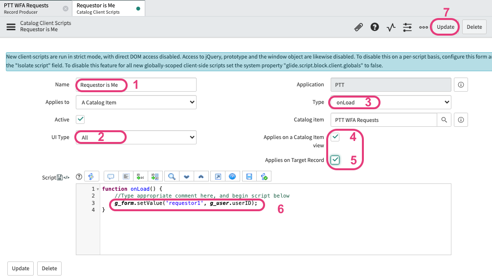

    Click the **Submit** button. 

{:style="counter-reset:none"}
1.  Close the **Studio** browser tab. 

[Next Exercise 3](/pages/ex3.html){: .btn .btn-purple }