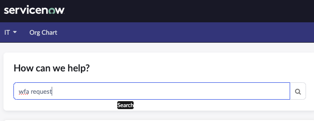
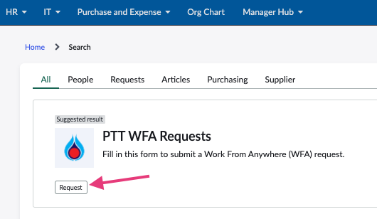
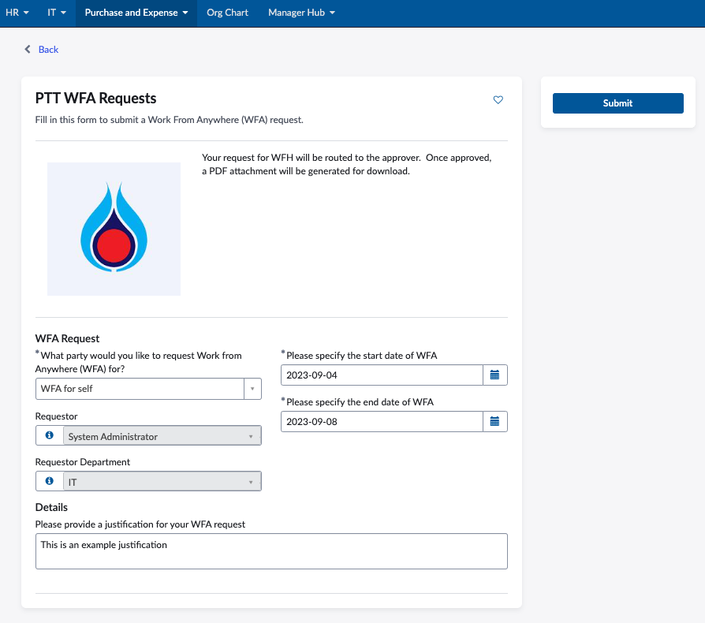
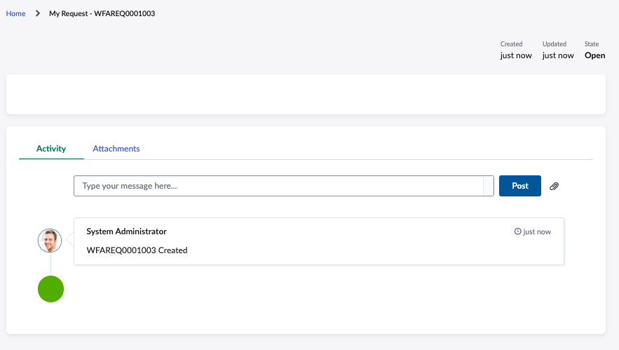

# Exercise 3: Testing the Record Producer Form
{: .fs-9 .text-blue-100}

**Duration: 20 minutes**

## Introduction
{: .text-blue-100}

In this section we will test the record produce form created in Exercise 2. We will create a new WFA request by submitting the WFA Request form.    

## Test the WFA Request Form
{: .text-blue-100}
1.  Visit the ServiceNow **Employee Center**, you can do so by visiting the base URL adding **/esc** to the end (i.e. **http://\[replace_with_your_instance_ID\].service-now.com/esc**) in a new browser tab.  

{:style="counter-reset:none"}
1.  In the **How can we help?** search bar, search for **wfa request**. 

    

{:style="counter-reset:none"}
1.  Click the **Request** button of the returned **PTT WFA Request** record producer.  

    

{:style="counter-reset:none"}
1.  This opens a new PTT WFA Request form.  Fill in the form. Click **Submit**

    

    > Note: Only if you have completed the optional items in Exercise 2, you will see the Requestor and Requestor Department is auto populated as disply \(read-only) information for the requestor.  
    
{:style="counter-reset:none"}
1.  The new request is then submitted. 

    

{:style="counter-reset:none"}
1.  

    

[Next Exercise 4](pages/ex4.html){: .btn .btn-purple }