# Exercise 3: Testing the Record Producer Form
{: .fs-9 .text-blue-100}

**Duration: 20 minutes**

## Introduction
{: .text-blue-100}

In this section we will test the record produce form created in Exercise 2. We will create a new WFA request by submitting the WFA Request form.    

## Test the WFA Request Form
{: .text-blue-100}
1. In a new browser tab, visit your instance base URL.  For example,  **http://\[replace_with_your_instance_ID\].service-now.com**.  

{:style="counter-reset:none"}
1. Click the **All** navigator tab and search **user admin**, select **Users** under User Administration. 

    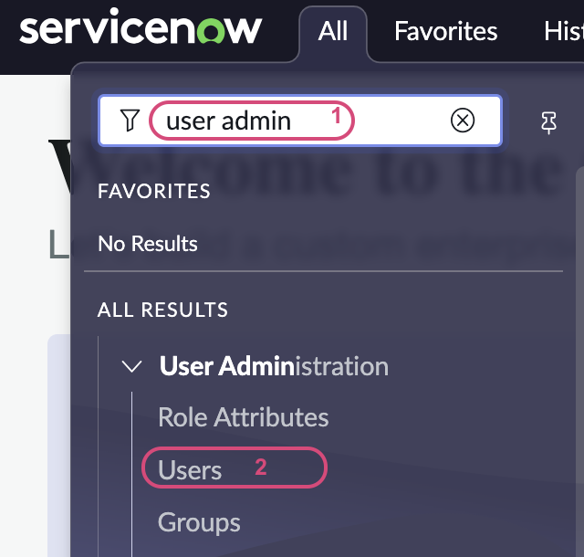

    Search for **Billie Cowley**. 

    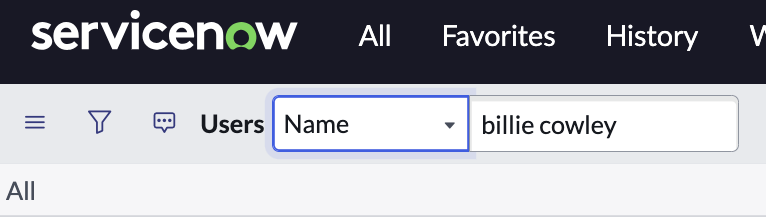

    Open Billie's user record.  Click the **Role** tab from the related list, click **Edit**. 
    
    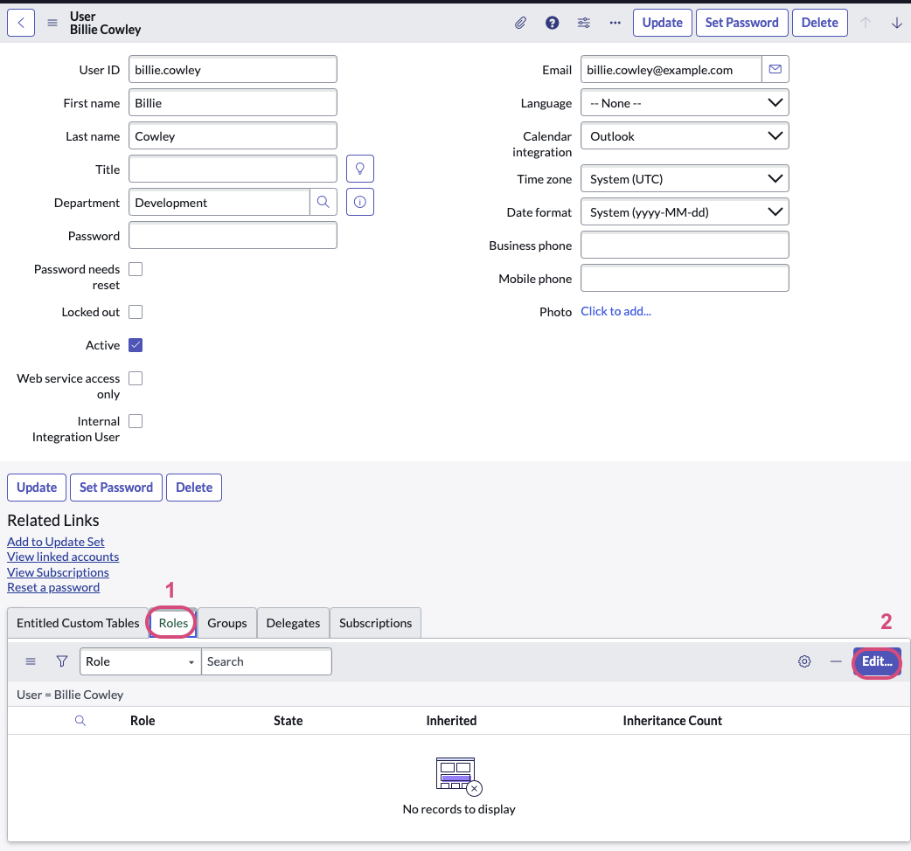

    From Collections, search for **x_snc_ptt**, identify the user role as **x_snc_ptt.user**, add this role for Billie.  

    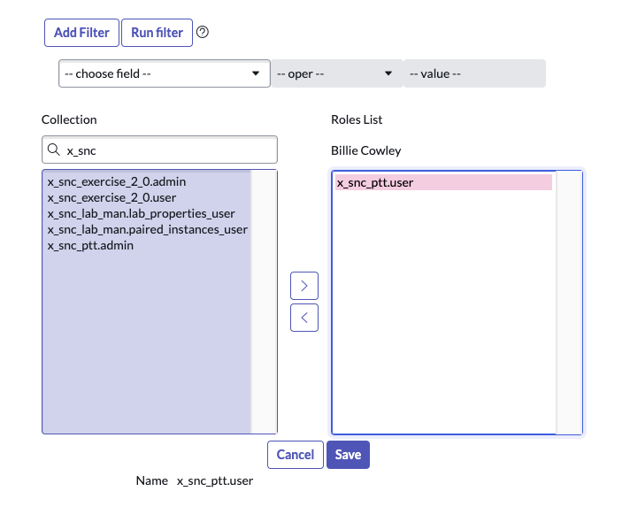

    This is what Billie's roles list looks like

    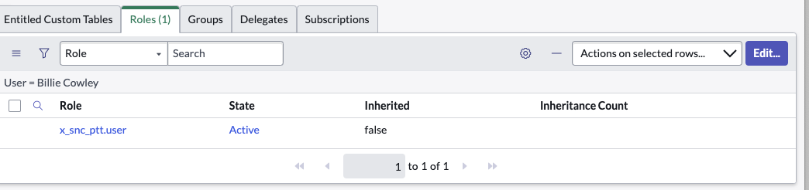

    Click **Update** button to complete updating Billie's record. 

{:style="counter-reset:none"}
1. Click the settings icon to configure the user list layout to show Billie's manager info.

   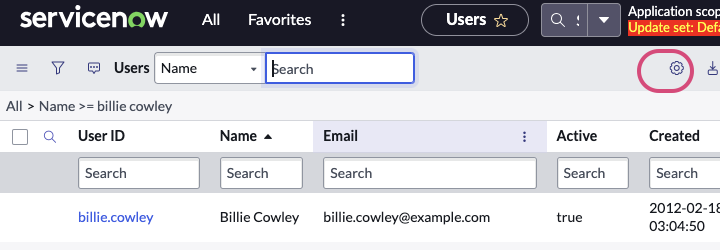

{:style="counter-reset:none"}
1. Select the Personalized list as shown below.  Click **OK**.

   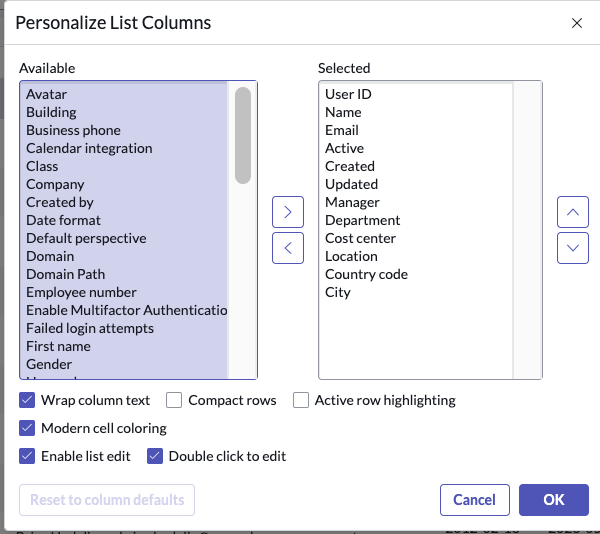

{:style="counter-reset:none"}
1. Now that Billie's **manager** is shown, click **Krystle Stika**. 

   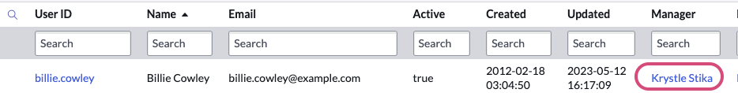

    Click the **Role** tab from the related list, click **Edit**. 
    
    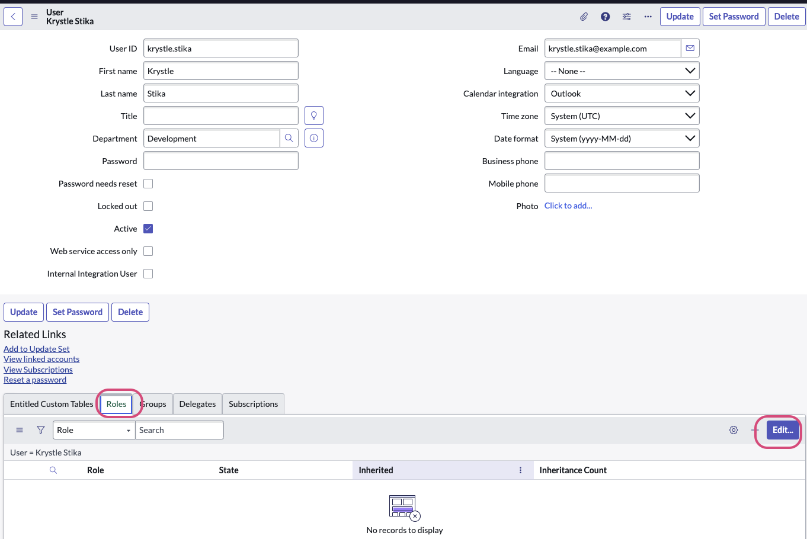

    From Collections, search for **approver**, identify the user role as **approver_user**, add this role for Krystle.  

    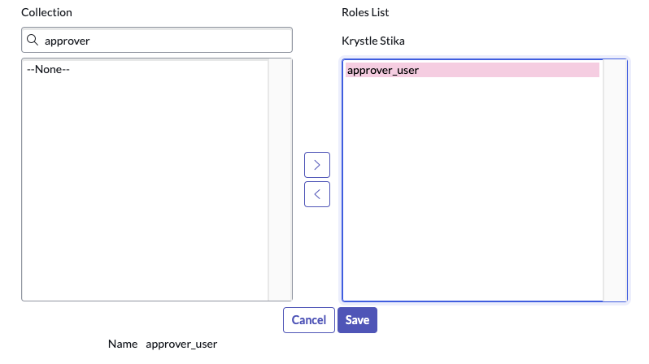

    Click Update on Krystle's user record. 

    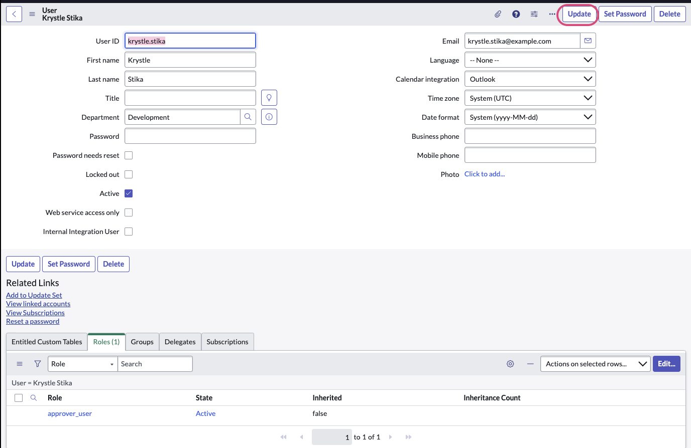

{:style="counter-reset:none"}
1. Click the top-right **user icon**, from the drop-down select **Impersonate user**.

   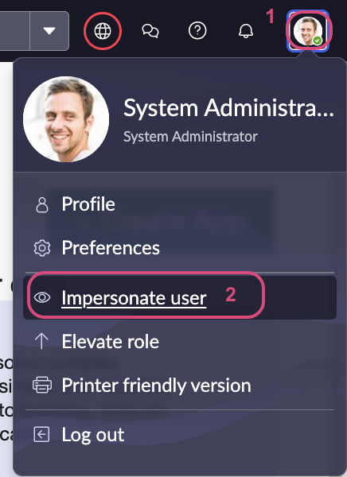

    Search for **Billie Cowley** and click the **Impersonate User** button. 

    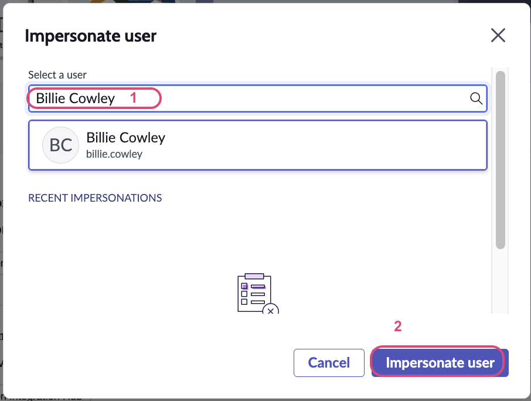

{:style="counter-reset:none"}
1.  As Billie Cowley, visit the ServiceNow **Service Portal**, use the base URL adding **/sp** to the end.  For example, **http://\[replace_with_your_instance_ID\].service-now.com/sp**.

{:style="counter-reset:none"}
1.  In the **How can we help?** search bar, search for **wfa request**. 

    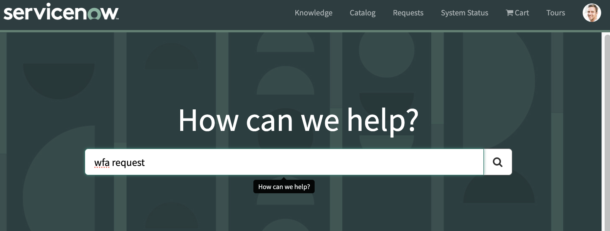

{:style="counter-reset:none"}
1.  Click on the first returned **Request** record producer which is the **PTT WFA Request**.  Note that there are data fields that are automatically populated as we included one script line to update the Requestor as the logged in user, and the user's relevant info such as department and manager (approver) is shown respectively.

    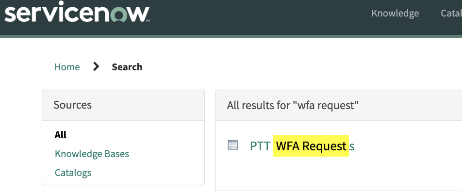

{:style="counter-reset:none"}
1.  This opens a new PTT WFA Request form.  Fill in the form. Click **Submit**

    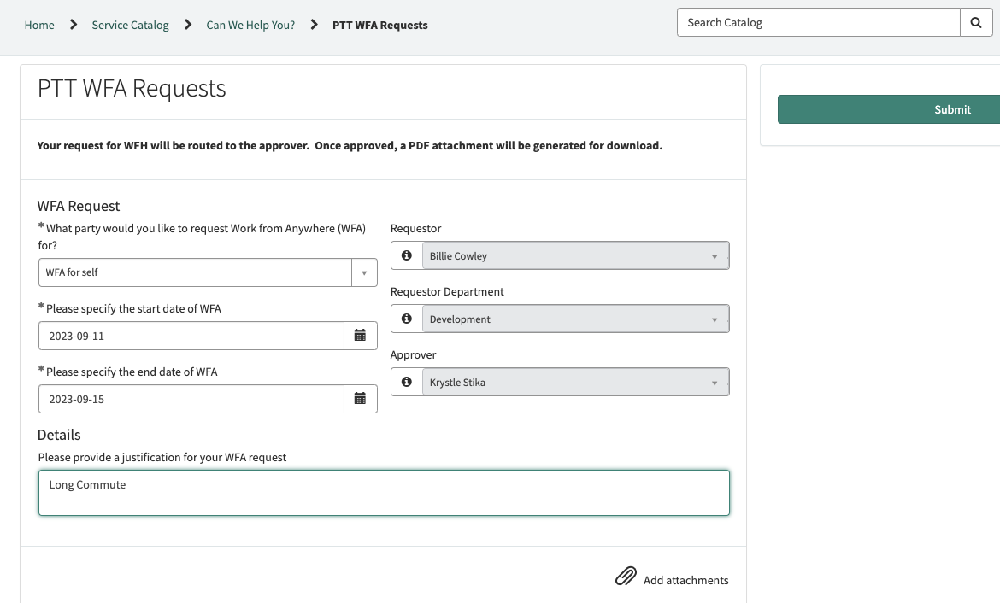 
    
{:style="counter-reset:none"}
1.  The new request is then submitted. 

    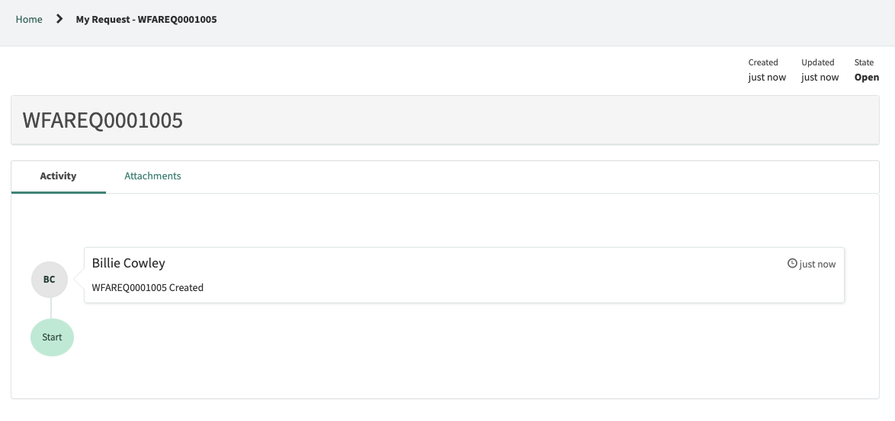

{:style="counter-reset:none"}
1.  Go back to the base URL of the instance.  Click on the top-left Profile icon, from the drop-down select **End Impersonation**.  

    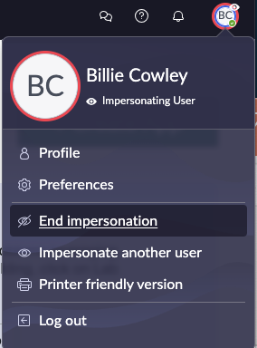

[Next Exercise 4](/pages/ex4.html){: .btn .btn-purple }