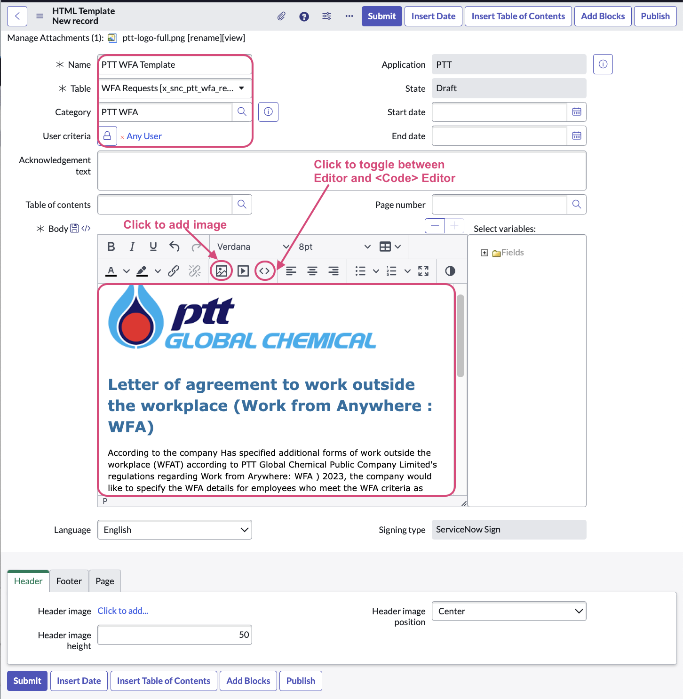
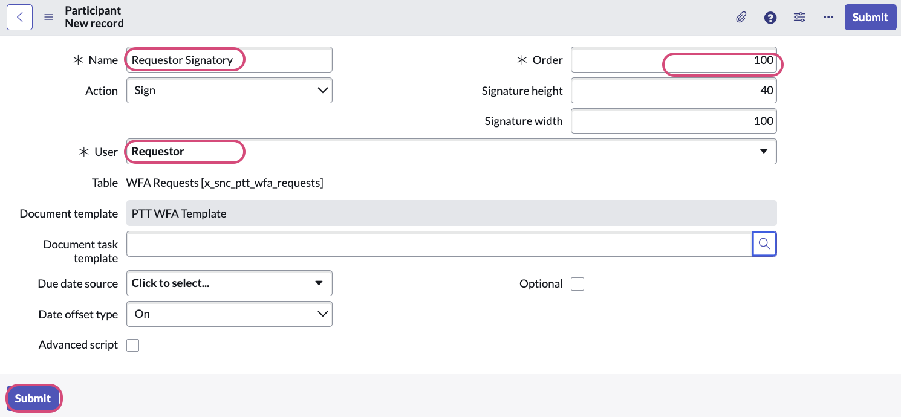
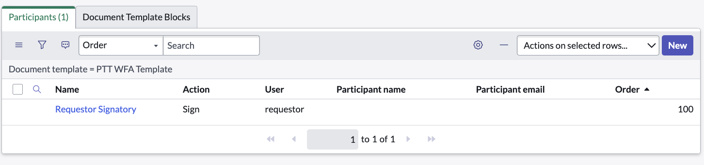

# Exercise 4: Configure HTML Template
{: .fs-9 .text-blue-100}

**Duration: 20 minutes**

{: .text-blue-100}
1.  In a new browser tab, visit the platform base URL.  From the **All** navigator, search for **Document Template**.  Click **Document Template Categories**. 

    

{:style="counter-reset:none"}
1.  Click **New** button to create a new Document Template Category.  Name the Document Category as **PTT WFA**.  Click **Submit**.

    

{:style="counter-reset:none"}
1.  From the **All** navigator, search for **Document Template**.  Click **All Document Template**. 
    

{:style="counter-reset:none"}
1.  Click **New** button to create a new Document Template.  Select **HTML Document Template**.  Fill the Document Template form as follows

    Name | Selection / Values
    -------------- | --------------
    Name | **PTT WFA Template**
    Table | **WFA Requests**
    Category | **PTT WFA** 
    User criteria | **Any user** 
    
    The **Body** should read text similar to the following:

    

    Watch the clip to see the steps to create the HTML template.  Toggle the **<>** code button to insert HTML code to the Body. Note that the HTML code can be copied and pasted from below. 
    
    

```markdown
<p>&nbsp;</p>
<p>&nbsp;</p>
<div><strong><span style="font-size: 18pt; color: #236fa1;">Letter of agreement to work outside the workplace (Work from Anywhere : WFA)</span></strong></div>
<div>&nbsp;</div>
<div><span style="font-size: 10pt; color: #000000;">According to the company Has specified additional forms of work outside the workplace (WFAT) according to PTT Global Chemical Public Company Limited's regulations regarding Work from Arywhere: WFA ) 2023, the company would like to specify the WFA details for employees who meet the WFA criteria as follows: </span></div>
<ol style="list-style-position: inside;">
<li style="font-size: 10pt;"><span style="font-size: 10pt; color: #000000;">Rule one paragraph</span></li>
<li style="font-size: 10pt;"><span style="font-size: 10pt; color: #000000;">Rule two paragraph</span></li>
<li style="font-size: 10pt;"><span style="font-size: 10pt; color: #000000;">Rule three paragraph</span></li>
</ol>
<p><span style="font-size: 10pt;">In the event that the employee wishes to WFA according to the above details, please verify your information and sign:</span></p>
<p><span style="font-size: 10pt;">I, <span style="color: #236fa1;">${opened_by.name}</span>, of position <span style="color: #236fa1;">${opened_by.department}</span>, section <span style="color: #236fa1;">${opened_by.cost_center}, </span>would like to operate the <span style="color: #3598db;">${request_type} <span style="color: #000000;">between the start date of <span style="color: #236fa1;">${start_date}</span> and end date of <span style="color: #236fa1;">${end_date}</span>.&nbsp; </span></span>I acknowledge and understand the details of the WFA, technicians and I will comply with the WFA company requirements.<br /></span></p>
<div>&nbsp;</div>
<div>
<table style="border-collapse: collapse; width: 100.016%;" border="1">
<tbody>
<tr>
<td style="width: 47.4887%; text-align: right;"><span style="font-size: 10pt;">Signature</span></td>
<td style="width: 47.4887%;">&nbsp;</td>
</tr>
<tr>
<td style="width: 47.4887%; text-align: right;"><span style="font-size: 10pt;">Date</span></td>
<td style="width: 47.4887%;"><span style="font-size: 10pt; color: #3598db;">${Date}&nbsp;</span></td>
</tr>
</tbody>
</table>
</div>
<p><span style="font-size: 10pt;">&nbsp;</span></p>
<p>&nbsp;</p>
<p>&nbsp;</p>
```
    

{:style="counter-reset:none"}
1.  **Right click** on the top horizontal grey bar, click **Save**.

    

{:style="counter-reset:none"}
1.  The **Participants** related list should appear after the Document Template is Saved. Click **New** to add a new participant to the Document Template. **Update** the form as shown below and click **Submit**.

    

    The participant added should be similar to the below:

    

{:style="counter-reset:none"}
1.  From the body, scroll down to the bottom and locate the last Table with **Signature** in the first column, click into the empty second column.  Click **Insert Signature** button.  Select **Requestor Signatory** as the participant.  Click **Ok**, and **Save** the Document Template form. 

    

{:style="counter-reset:none"}
1.  Click **Publish**.

{:style="counter-reset:none"}
1.  Click **Preview** and select the **WFA Requests record** we submitted in Exercise 3 record producer test.  

    

{:style="counter-reset:none"}
1.  Close the **Preview**.  Return back to App Engine Studio **AES Home** tab.


[Next Exercise 5](/pages/ex5.html){: .btn .btn-purple }