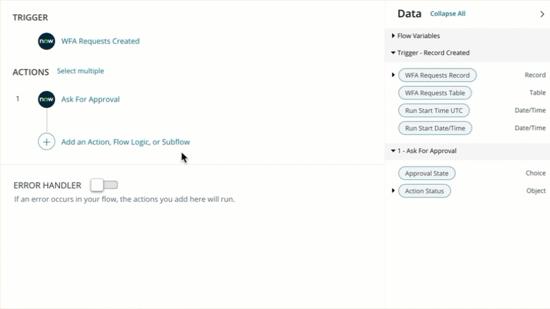
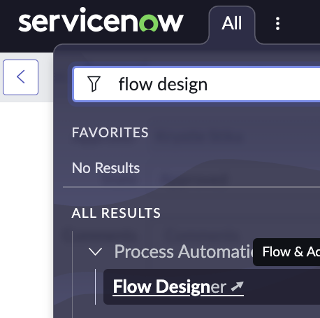
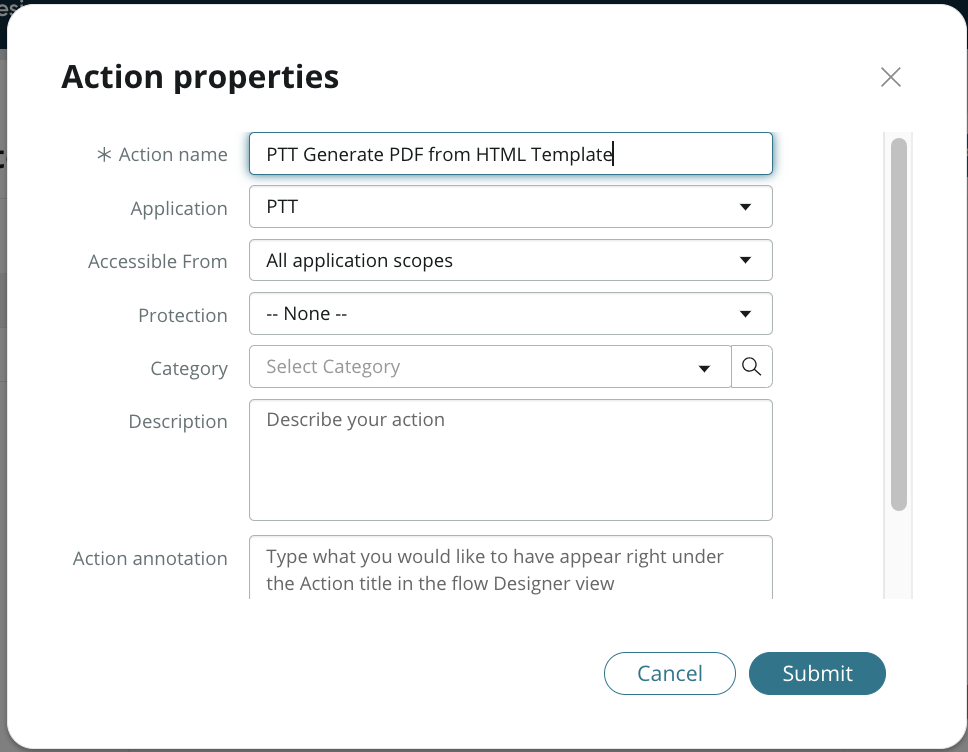

# Exercise 5: Build the Workflow
{: .fs-9 .text-blue-100}

**Duration: 20 minutes**

## Approval Request Workflow
{: .text-blue-100}
1.  Visit the ServiceNow **Employee Center**, you can do so by visiting the base URL adding **/esc** to the end (i.e. **http://<span style="color:teal">\[replace_with_your_instance_ID\]</span>.service-now.com<span style="color:teal">/esc</span>**) in a new browser tab.  

{:style="counter-reset:none"}
1.  Return back to App Engine Studio **AES Home** tab.  Click **+ Add** next to ***Logic and Automation**

    

{:style="counter-reset:none"}
1.  From **What do you want to add?** page, select **Flow**

    

{:style="counter-reset:none"}
1.  From **How do you want to add an automated workflow to your app?** page, select **Build from Scratch**

    

{:style="counter-reset:none"}
1.  Name the flow as **WFA Request Flow**, Description as **Sends Approval Request and Generates PDF Document**, select Run as **System user**.  Click **Continue**.

    

{:style="counter-reset:none"}
1.  Click **Edit this flow**

{:style="counter-reset:none"}
1.  Add a **trigger** to the flow.

    

    The trigger should look like this:

    

{:style="counter-reset:none"}
1.  Add an **Ask for Approval** Action.  

    

    The action should look this this:

    

{:style="counter-reset:none"}
1.  Add the **If** Flow logic for the **Approved** Condition

    

    The **IF** flow logic should look this this:

    

{:style="counter-reset:none"}
1.  Add the **Else If** Flow logic for the **Rejected** Condition

    

    The **Else IF** flow logic should look this this:

    


{:style="counter-reset:none"}
1. Add **Update Record** action within the **IF** flow logic.

    

    The **Update Record** action should look this this:

    

{:style="counter-reset:none"}
1.  Add **Update Record** action within the **ELSE IF** flow logic.

    The **Update Record** action should look this this:

    
    
{:style="counter-reset:none"}
1.  **Test** the workflow. After reviewing the test results, click **Cancel** from the Test flow modal.

    

    The flow is **waiting for approval**

    

{:style="counter-reset:none"}
1.  From the **All** Navigator, search for **My Approvals**, select Self-Service **My Approvals**.

    

    Remove the filter breadcrumbs by clicking at the **All**. 

    

    You should see the list of approval requests on the platform, please sort by Created field. Click **Requested** to open the approval record. 

    

{:style="counter-reset:none"}
1.  Change the state to **Approved** and click **Update** button. The record is now approved. 

    

{:style="counter-reset:none"}
1.  Access **Flow Designer** from the **All** navigator

    

    Click **New** and select **Action** to create an reusable action. 

    

    Give the action a name.  Click **Submit**

    

{:style="counter-reset:none"}
1.  Create 3 **Inputs** for the action

    

{:style="counter-reset:none"}
1.  Add a **Script** step after the inputs. The script 

```markdown
outputs.attachmentid = new sn_doc.GenerateDocumentAPI().generateDocumentForTask(inputs.record_id, inputs.doc_template_id, inputs.file_name);  
```
    

    The result should look like this: 

   

{:style="counter-reset:none"}
1.  Click **Publish**

{:style="counter-reset:none"}
1.  Return to AES flow designer and add the Generate PDF action within the **IF** flow logic.

    

    You flow should look like this

    

{:style="counter-reset:none"}
1. **Activate** your workflow.


[Next Exercise 6](/pages/ex6.html){: .btn .btn-purple }