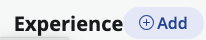
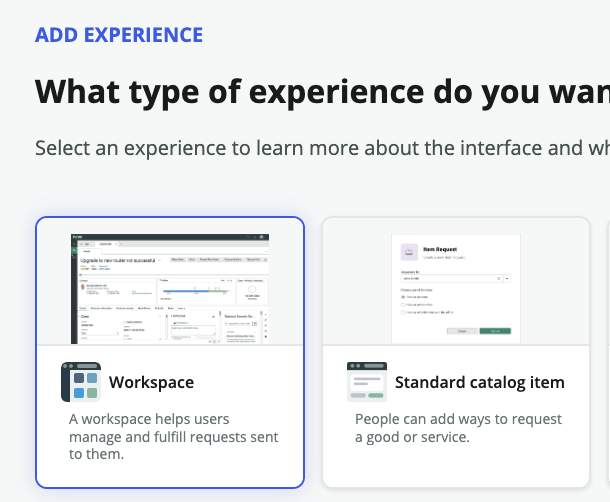
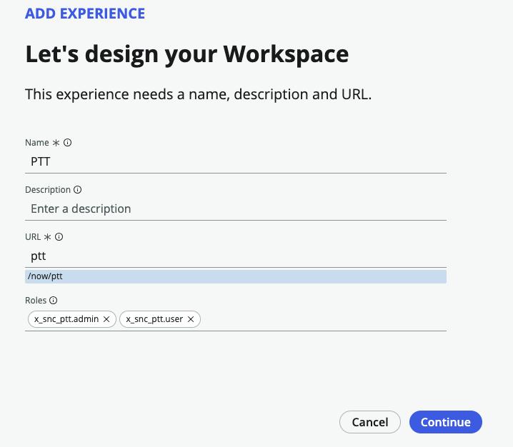
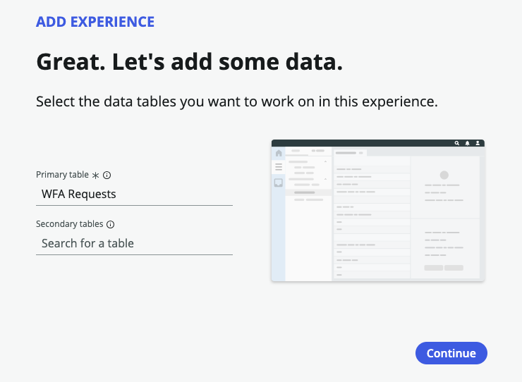
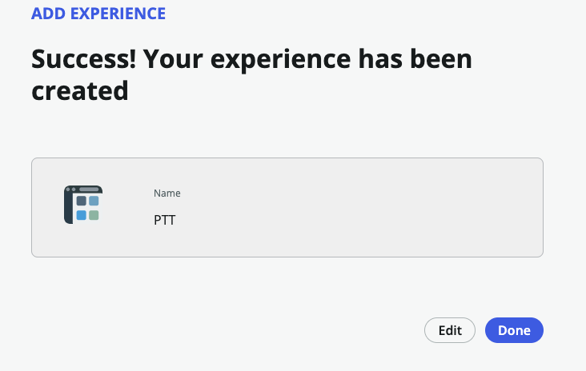
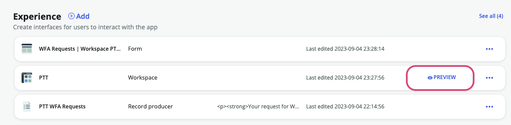
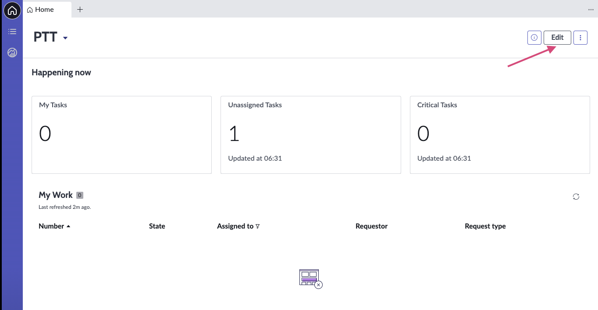

# Exercise 6: Build the Workspace
{: .fs-9 .text-blue-100}

**Duration: 20 minutes**

## Workspace as the User Experience
{: .text-blue-100}
1.  From **AES Home** tab, from the **Experience** section, click **+ Add**.  

    

{:style="counter-reset:none"}
1.  Select **Workspace**. Click **Continue**.

    

{:style="counter-reset:none"}
1.  From the **Let's design your workspace** page, **Name** your workspace **PPT**.  Click **Continue**.

    

{:style="counter-reset:none"}
1.  From the **Great. Let's add some data** page, note the WFA Request _primary_ table.  Click **Continue**.

    

{:style="counter-reset:none"}
1.  From **Success! Your experience has been created** page, click **Done**.

    

{:style="counter-reset:none"}
1.  Click **Preview** on the PTT Workspace Experience.

    

    This is what the workspace looks like initially.  Note the **Edit** button allowing workspaces to be edited as WYSIWYG. 

    

{:style="counter-reset:none"}
1.  

    

{:style="counter-reset:none"}
1.  

    

{:style="counter-reset:none"}
1.  

    

{:style="counter-reset:none"}
1.  

    

{:style="counter-reset:none"}
1.  

    

{:style="counter-reset:none"}
1.  

    